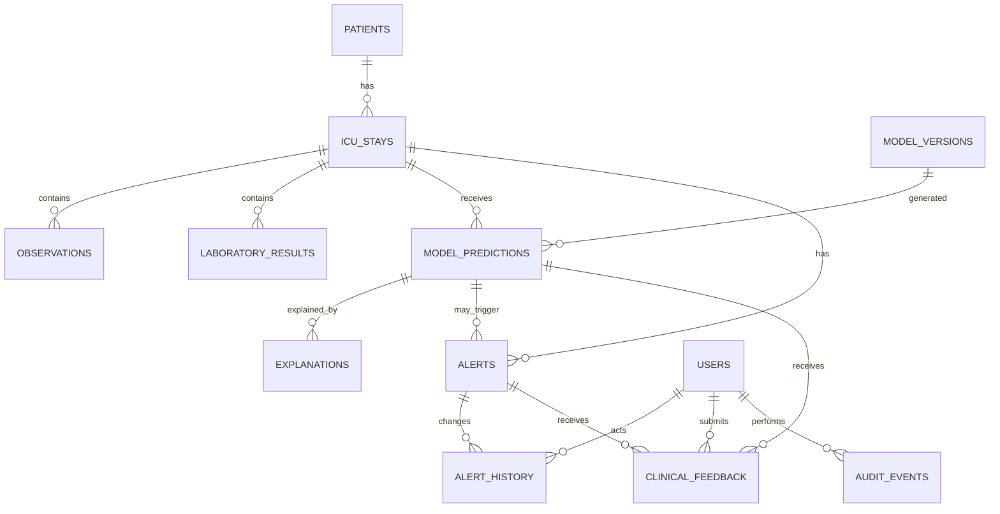

# SepsisGuard PostgreSQL Data Model

The prototype stores pseudonymous event identifiers only. It must not store names, addresses, phones, emails, full dates of birth, MRNs, free-text notes, or credentials. Generate `external_subject_hash` and source IDs outside this database using an approved rotated keyed hash.

Executable SQL: [schema.sql](../deployment/database/schema.sql).

## ER diagram

## Schema choices

| Table | Role | Key lineage |
|---|---|---|
| `patients` | Pseudonymous cohort entity | `patient_id`; no direct identifiers. |
| `icu_stays` | Admission-scoped timeline | `stay_id → patients`. |
| `observations`, `laboratory_results` | Immutable source events | stay ID, clinical and received times, source-event hash. |
| `model_versions` | Reproducible artifact registry | artifact/feature-schema hashes, validation summary, lifecycle. |
| `model_predictions` | Exact serving evidence | stay, model, risk/interval/confidence, feature snapshot, correlation ID. |
| `explanations` | Attribution evidence | prediction, method/version, reference, local factors, disclaimer. |
| `alerts`, `alert_history` | Stateful decision trail | active state and every transition. |
| `clinical_feedback` | Structured human evaluation | prediction/alert and redacted feedback only. |
| `system_logs`, `audit_events` | Operational accountability | correlation ID and actor/state change. |

Foreign keys prevent orphaned lineage. Cascades apply only from prediction to explanation and alert to history; source data, predictions, feedback, and audit records are not silently removed.

## Indexes, versioning, and auditability

Indexes cover patient/stay timelines, active alerts, model-version analysis, deduplication, correlation IDs, and audit queries. In production partition `observations`, `laboratory_results`, `model_predictions`, `system_logs`, and `audit_events` monthly by event time with equivalent partition-local indexes.

Each prediction pins a model version, semantic version, artifact hash, feature-schema hash, calibration method, threshold, and feature snapshot. Explanations capture attribution method/version and reference baseline. Correlation IDs join ingestion, prediction, alert, feedback, log, and audit records.

Use distinct least-privilege application roles for ingestion, inference, clinical feedback, analysis, and administration. Require TLS, encryption, migrations, backup-restore tests, and audited/append-only access paths before non-prototype use.

## Retention

- Raw observations and labs: 30 days hot, then approved aggregate or de-identified archive.
- Predictions, explanations, alerts, history, feedback, and audit: seven years or approved governance period.
- System logs: 90 days hot, then protected security archive.

Retention jobs require privilege, are logged in `audit_events`, run against partition boundaries, and never use ad-hoc deletion. Legal hold, incident investigation, and governance rules override automatic expiry.
