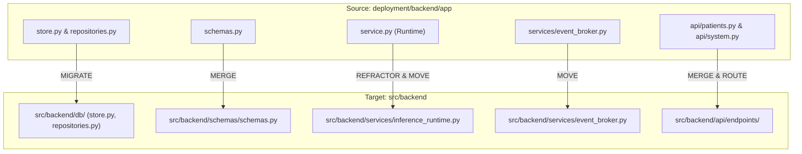

# ARGUS Part 2 Backend Consolidation Plan

## 1. Objective
The objective of this document is to establish a comprehensive, evidence-based migration and consolidation plan to merge the two existing backend implementations into a **single, unified, production-grade Part 2 backend** under `src/backend`.

This plan is created in strict read-only mode following Phase 0 (Backup & Baseline Protection) and Phase 1 (Complete Technical Audit). **No application code is modified during this planning step.**

---

## 2. Current Backend Implementations

The project currently contains two distinct, un-synchronized backend codebases:

1. **`src/backend` (Enterprise Scaffold / Mock Runtime):**
   - **Framework:** FastAPI with clean modular directory layout (`core/`, `api/router.py`, `schemas/`, `services/`).
   - **Database:** None (uses in-memory Python dictionaries: `patients_db = {}`, `vitals_db = {}`).
   - **Inference:** Mock random float generator (`random.uniform(0.1, 0.9)`).
   - **WebSocket:** Text echo endpoint (`Message text was: ...`).
2. **`deployment/backend/app` (Working Model / Storage Runtime):**
   - **Framework:** FastAPI with monolithic script `main.py` and secondary router modules (`api/patients.py`, `api/system.py`).
   - **Database:** SQLAlchemy ORM with SQLite/Postgres storage (`store.py`).
   - **Inference:** Embedded `Runtime` class in `service.py` loading `xgb_model.json`, computing 31 sliding-window features over in-memory `deque`, and running `SmartAlertEngine`.
   - **WebSocket:** Live JSON event broker streaming predictions and alerts.

---

## 3. src/backend Inventory

| File Path | Component Type | Purpose / Description | Code Evidence Reference |
|---|---|---|---|
| [`src/backend/main.py`](file:///c:/Users/HP/Desktop/Argus/argus-sepsiswarner/src/backend/main.py) | Application Entry | Initializes `FastAPI` instance, configures CORS, includes `api_router`. | Lines 7–21 |
| [`src/backend/core/config.py`](file:///c:/Users/HP/Desktop/Argus/argus-sepsiswarner/src/backend/core/config.py) | Configuration | `BaseSettings` declaring `PROJECT_NAME`, `API_V1_STR`, `MODEL_VERSION`. | Lines 3–7 |
| [`src/backend/core/security.py`](file:///c:/Users/HP/Desktop/Argus/argus-sepsiswarner/src/backend/core/security.py) | Auth / Security | OAuth2 Bearer token mock dependency (`get_current_user`). | Lines 8–13 |
| [`src/backend/core/logging.py`](file:///c:/Users/HP/Desktop/Argus/argus-sepsiswarner/src/backend/core/logging.py) | Logging | Configures standard Python logging handlers. | Lines 4–7 |
| [`src/backend/core/exceptions.py`](file:///c:/Users/HP/Desktop/Argus/argus-sepsiswarner/src/backend/core/exceptions.py) | Exception Handling | Defines `NotFoundException`, `InferenceException`. | Lines 1–15 |
| [`src/backend/api/router.py`](file:///c:/Users/HP/Desktop/Argus/argus-sepsiswarner/src/backend/api/router.py) | API Router | Includes `health.router` and `patients.router`. | Lines 4–6 |
| [`src/backend/api/endpoints/health.py`](file:///c:/Users/HP/Desktop/Argus/argus-sepsiswarner/src/backend/api/endpoints/health.py) | Health Route | REST endpoints: `GET /health`, `GET /model-version`. | Lines 6–12 |
| [`src/backend/api/endpoints/patients.py`](file:///c:/Users/HP/Desktop/Argus/argus-sepsiswarner/src/backend/api/endpoints/patients.py) | Patient Router | Patient CRUD, risk, explanation, alerts, and `/ws` text echo endpoint. | Lines 10–64 |
| [`src/backend/schemas/schemas.py`](file:///c:/Users/HP/Desktop/Argus/argus-sepsiswarner/src/backend/schemas/schemas.py) | Data Schemas | Pydantic models: `Patient`, `Vital`, `RiskAssessment`, `Alert`, `Explanation`. | Lines 4–41 |
| [`src/backend/services/patient_service.py`](file:///c:/Users/HP/Desktop/Argus/argus-sepsiswarner/src/backend/services/patient_service.py) | Patient Service | Manages mock patient storage using in-memory dicts `patients_db`, `vitals_db`. | Lines 5–35 |
| [`src/backend/services/inference_service.py`](file:///c:/Users/HP/Desktop/Argus/argus-sepsiswarner/src/backend/services/inference_service.py) | Inference Service | Generates random mock risk score (`random.uniform(0.1, 0.9)`) and static SHAP dict. | Lines 5–27 |
| [`src/backend/services/alert_engine.py`](file:///c:/Users/HP/Desktop/Argus/argus-sepsiswarner/src/backend/services/alert_engine.py) | Alert Service | Emits critical alert if mock risk score > 0.7. | Lines 6–19 |
| [`src/backend/Dockerfile`](file:///c:/Users/HP/Desktop/Argus/argus-sepsiswarner/src/backend/Dockerfile) | Deployment Container | Dockerfile building `src/backend`. | Lines 1–15 |

---

## 4. deployment/backend/app Inventory

| File Path | Component Type | Purpose / Description | Code Evidence Reference |
|---|---|---|---|
| [`deployment/backend/app/main.py`](file:///c:/Users/HP/Desktop/Argus/argus-sepsiswarner/deployment/backend/app/main.py) | App Entry / Inline Server | FastAPI server with inline routes `/health`, `/v1/events/vitals`, `/v1/stream`, `/v1/simulator/start`. | Lines 11–67 |
| [`deployment/backend/app/api/patients.py`](file:///c:/Users/HP/Desktop/Argus/argus-sepsiswarner/deployment/backend/app/api/patients.py) | Patient Router | Modular DB-backed patient REST routes (`/patients`, `/{id}/vitals`, `/{id}/trajectory`, `/{id}/risk`, `/{id}/explanation`, `/{id}/alerts`). | Lines 6–29 |
| [`deployment/backend/app/api/system.py`](file:///c:/Users/HP/Desktop/Argus/argus-sepsiswarner/deployment/backend/app/api/system.py) | System Router | Routes `/health`, `/model-version`, `/events/vitals`, `/ws/updates`. | Lines 8–22 |
| [`deployment/backend/app/config.py`](file:///c:/Users/HP/Desktop/Argus/argus-sepsiswarner/deployment/backend/app/config.py) | Configuration | `BaseSettings` declaring `database_url`, `api_key`, `environment`, `cors_origins`. | Lines 5–14 |
| [`deployment/backend/app/auth.py`](file:///c:/Users/HP/Desktop/Argus/argus-sepsiswarner/deployment/backend/app/auth.py) | Authentication | Header dependency `require_api_key` validating `x-api-key`. | Lines 5–11 |
| [`deployment/backend/app/store.py`](file:///c:/Users/HP/Desktop/Argus/argus-sepsiswarner/deployment/backend/app/store.py) | Database ORM | SQLAlchemy engine & models: `PatientRecord`, `VitalRecord`, `PredictionRecord`, `AlertRecord`. | Lines 6–27 |
| [`deployment/backend/app/repositories.py`](file:///c:/Users/HP/Desktop/Argus/argus-sepsiswarner/deployment/backend/app/repositories.py) | DB Repository | `PatientRepository` executing SQLAlchemy `select()` queries. | Lines 4–15 |
| [`deployment/backend/app/schemas.py`](file:///c:/Users/HP/Desktop/Argus/argus-sepsiswarner/deployment/backend/app/schemas.py) | Data Schemas | Production event schemas: `VitalEvent`, `PredictionResponse`, `SimulatorRequest`, `EventEnvelope`, etc. | Lines 5–52 |
| [`deployment/backend/app/service.py`](file:///c:/Users/HP/Desktop/Argus/argus-sepsiswarner/deployment/backend/app/service.py) | Runtime ML Engine | `Runtime` class: loads `xgb_model.json`, feature engineering (31 features), signal quality, smart alerts. | Lines 16–60 |
| [`deployment/backend/app/services/patient_service.py`](file:///c:/Users/HP/Desktop/Argus/argus-sepsiswarner/deployment/backend/app/services/patient_service.py) | Patient Service | Invokes `PatientRepository` for database CRUD. | Lines 4–16 |
| [`deployment/backend/app/services/inference_service.py`](file:///c:/Users/HP/Desktop/Argus/argus-sepsiswarner/deployment/backend/app/services/inference_service.py) | Inference Service | Executes `runtime.predict()`, saves vitals/predictions/alerts to DB, publishes to WebSocket. | Lines 8–19 |
| [`deployment/backend/app/services/event_broker.py`](file:///c:/Users/HP/Desktop/Argus/argus-sepsiswarner/deployment/backend/app/services/event_broker.py) | Event Broker | `LocalEventBroker` managing active WebSocket subscribers and broadcasting JSON messages. | Lines 3–11 |

---

## 5. Component Comparison

| Component | `src/backend` | `deployment/backend/app` | Superior Implementation | Recommended Action |
|---|---|---|---|---|
| **Directory Architecture** | Modular (`core/`, `api/`, `schemas/`, `services/`) | Flat / hybrid (`main.py` + `api/` + `services/`) | `src/backend` | **PRESERVE** `src/backend` directory structure. |
| **REST API Handlers** | Mock random data, non-persistent | DB-backed (`PatientRepository`), event ingestion (`InferenceService`) | `deployment/backend/app` | **MIGRATE** `deployment` handlers into `src/backend/api/endpoints/`. |
| **WebSocket Handler** | Text echo (`Message text was: ...`) | Pub/sub `LocalEventBroker` broadcasting live JSON payloads | `deployment/backend/app` | **MIGRATE** `event_broker` and stream handler to `src/backend`. |
| **Database Persistence** | In-memory dicts (`patients_db`) | SQLAlchemy ORM engine & repositories (`store.py`, `repositories.py`) | `deployment/backend/app` | **MIGRATE** SQLAlchemy ORM models into `src/backend/db/`. |
| **ML Inference Engine** | Random float generator (`random.uniform(0.1, 0.9)`) | `Runtime` class loading `xgb_model.json`, computing 31 features, calling `SmartAlertEngine` | `deployment/backend/app` | **MIGRATE** `Runtime` class and ML inference pipeline into `src/backend/services/`. |
| **Pydantic Schemas** | Primitive schemas (`Vital`, `RiskAssessment`) | Comprehensive event schemas (`VitalEvent`, `PredictionResponse`, `TrajectoryResponse`) | `deployment/backend/app` | **MERGE** schemas into `src/backend/schemas/schemas.py`. |
| **Authentication** | Bearer token mock check (`core/security.py`) | Header `x-api-key` check (`auth.py`) | Merged Hybrid | **MERGE** into `src/backend/core/security.py` supporting both Bearer & API Key headers. |

---

## 6. REST API Comparison

| HTTP Method | `src/backend` Path | `deployment/backend/app` Path | Proposed Target Path | Target Implementation Logic |
|---|---|---|---|---|
| `GET` | `/api/v1/health` | `/health` | `/api/v1/health` | Combine status, model version, and DB connectivity health checks. |
| `GET` | `/api/v1/model-version` | `/model-version` | `/api/v1/model-version` | Return `ModelVersionResponse` schema with model version & fallback flag. |
| `POST` | `/api/v1/patients` | `/patients` | `/api/v1/patients` | Create patient in SQLAlchemy DB via `PatientRepository`. |
| `GET` | `/api/v1/patients/{id}` | `/patients/{id}` | `/api/v1/patients/{id}` | Retrieve patient record from SQLAlchemy DB. |
| `GET` | `/api/v1/patients/{id}/vitals` | `/patients/{id}/vitals` | `/api/v1/patients/{id}/vitals` | Query `VitalRecord` history from DB. |
| `GET` | `/api/v1/patients/{id}/trajectory` | `/patients/{id}/trajectory` | `/api/v1/patients/{id}/trajectory` | Query `PredictionRecord` risk history from DB. |
| `GET` | `/api/v1/patients/{id}/risk` | `/patients/{id}/risk` | `/api/v1/patients/{id}/risk` | Return latest prediction payload from DB. |
| `GET` | `/api/v1/patients/{id}/explanation` | `/patients/{id}/explanation` | `/api/v1/patients/{id}/explanation` | Extract contributing factors from latest prediction record. |
| `GET` | `/api/v1/patients/{id}/alerts` | `/patients/{id}/alerts` | `/api/v1/patients/{id}/alerts` | Query active & historical `AlertRecord` rows from DB. |
| `POST` | *None* | `/v1/events/vitals` | `/api/v1/events/vitals` | Ingest vital event, compute features, run inference, store DB, broadcast WS. |
| `POST` | *None* | `/v1/simulator/start` | `/api/v1/simulator/start` | Launch async background vital simulation stream task. |

---

## 7. WebSocket Comparison

| Attribute | `src/backend` | `deployment/backend/app` | Consolidated Target |
|---|---|---|---|
| **Route** | `/api/v1/ws` | `/v1/stream` (and `/ws/updates`) | `/api/v1/ws/stream` (with legacy alias `/v1/stream`) |
| **Direction** | Full-duplex echo | Server-to-client broadcast | Full-duplex broadcast stream |
| **Message Payload** | Raw string echo | Structured JSON `EventEnvelope` (`type`, `occurred_at`, `patient_id`, `payload`) | Structured JSON `EventEnvelope` |
| **Subscriber Management** | Local list inside `ConnectionManager` class in `endpoints/patients.py` | Global set inside `LocalEventBroker` in `services/event_broker.py` | Thread-safe `LocalEventBroker` service in `src/backend/services/event_broker.py` |

---

## 8. Database Comparison

1. **`src/backend` Database:** None (uses in-memory Python dictionaries `patients_db = {}`, `vitals_db = {}` in `services/patient_service.py`).
2. **`deployment/backend/app` Database:** Uses SQLAlchemy ORM in `store.py` with 4 tables (`patients`, `vital_events`, `predictions`, `alerts`).
3. **Canonical PostgreSQL Schema:** `deployment/database/schema.sql` defines 12 normalized tables (`users`, `patients`, `icu_stays`, `model_versions`, `observations`, `laboratory_results`, `model_predictions`, `explanations`, `alerts`, `alert_history`, `clinical_feedback`, `system_logs`, `audit_events`).
4. **Consolidation Decision:**
   - Immediately move SQLAlchemy ORM models from `deployment/backend/app/store.py` into `src/backend/db/store.py`.
   - Update table definitions during Phase 4 database alignment to map cleanly onto PostgreSQL `schema.sql`.

---

## 9. ML Implementation Comparison

1. **`src/backend` ML Implementation:**
   - File: [`src/backend/services/inference_service.py`](file:///c:/Users/HP/Desktop/Argus/argus-sepsiswarner/src/backend/services/inference_service.py)
   - Functionality: `random.uniform(0.1, 0.9)` score generation with hardcoded dictionary explanation `{"heart_rate": 0.6, "blood_pressure": 0.4}`.
2. **`deployment/backend/app` ML Implementation:**
   - File: [`deployment/backend/app/service.py`](file:///c:/Users/HP/Desktop/Argus/argus-sepsiswarner/deployment/backend/app/service.py)
   - Functionality: Embedded `Runtime` class loading `xgb_model.json` and calibrator, 31 feature calculation over `deque`, signal quality integration, and `SmartAlertEngine` integration.
3. **Target ML Architecture:**
   - Migrate `Runtime` engine from `deployment/backend/app/service.py` to `src/backend/services/inference_runtime.py`.
   - Replace mock `InferenceService` in `src/backend/services/inference_service.py` with real model execution wrapper calling `inference_runtime.py`.

---

## 10. Configuration Comparison

| Setting Key | `src/backend` (`core/config.py`) | `deployment/backend/app` (`config.py`) | Target Key (`src/backend/core/config.py`) |
|---|---|---|---|
| Project Title | `PROJECT_NAME = "Argus Backend"` | `title = "SepsisGuard local inference"` | `PROJECT_NAME = "ARGUS SepsisGuard AI"` |
| API Prefix | `API_V1_STR = "/api/v1"` | Inline path prefix `/v1` | `API_V1_STR = "/api/v1"` |
| Database URL | *None* | `database_url = 'sqlite:///./sepsisguard.db'` | `DATABASE_URL: str = 'sqlite:///./sepsisguard.db'` |
| CORS Origins | `allow_origins=["*"]` | `cors_origins = 'http://localhost:5173'` | `CORS_ORIGINS: list[str] = ["http://localhost:5173", "http://localhost:3000"]` |
| API Key | *None* | `api_key: str \| None = None` | `API_KEY: str \| None = None` |
| Environment | *None* | `environment: str = 'development'` | `ENVIRONMENT: str = 'development'` |

---

## 11. Dependency Comparison

Both backends share core Python dependencies: `fastapi`, `uvicorn`, `pydantic`, `pydantic-settings`, `sqlalchemy`, `xgboost`, `joblib`, `numpy`, `pandas`.

- `deployment/backend/app/service.py` dynamically imports `data/04_signal_quality.py` and `src/pipeline/11_smart_alert_engine.py` via `importlib.util`.
- Consolidation will convert dynamic file imports to standard Python module imports (`from src.pipeline.smart_alert_engine import SmartAlertEngine`).

---

## 12. Target Backend Architecture

The consolidated backend will be organized strictly under `src/backend/` as follows:

```
src/backend/
├── Dockerfile
├── main.py                          # Unified FastAPI application entry point
├── core/
│   ├── config.py                    # Consolidated BaseSettings (DB, CORS, Keys, Paths)
│   ├── security.py                  # Authentication dependencies (Bearer & API-Key)
│   ├── logging.py                   # Centralized logging configuration
│   └── exceptions.py                # Exception handlers & standard JSON error envelopes
├── db/
│   ├── store.py                     # SQLAlchemy database engine, Session, and ORM models
│   └── repositories.py              # Database access layer (PatientRepository)
├── schemas/
│   └── schemas.py                   # Unified Pydantic request/response schemas
├── services/
│   ├── patient_service.py           # DB-backed patient management service
│   ├── inference_service.py         # Real ML inference service wrapper
│   ├── inference_runtime.py         # Model loading, 31 feature engineering, prediction runner
│   ├── alert_engine.py              # SmartAlertEngine integration service
│   └── event_broker.py              # WebSocket broadcast event broker
└── api/
    ├── router.py                    # Central API router
    └── endpoints/
        ├── health.py                # GET /health, GET /model-version
        ├── patients.py              # Patient REST CRUD, vitals, trajectory, risk, alerts
        ├── events.py                # POST /events/vitals, POST /simulator/start
        └── websocket.py             # WebSocket stream subscriber endpoint (/ws/stream)
```

---

## 13. Component Migration Map



| Component | Current Source Location | Target Location | Migration Complexity | Risk Level |
|---|---|---|---|---|
| ORM Store & Repositories | `deployment/backend/app/store.py`, `repositories.py` | `src/backend/db/store.py`, `repositories.py` | Low | Low |
| Pydantic Schemas | `deployment/backend/app/schemas.py` | `src/backend/schemas/schemas.py` | Low | Low |
| Runtime ML Engine | `deployment/backend/app/service.py` | `src/backend/services/inference_runtime.py` | Medium | High |
| Event Broker | `deployment/backend/app/services/event_broker.py` | `src/backend/services/event_broker.py` | Low | Low |
| Patient REST Endpoints | `deployment/backend/app/api/patients.py` | `src/backend/api/endpoints/patients.py` | Medium | Medium |
| Vital Ingestion & Sim Endpoints | `deployment/backend/app/main.py` | `src/backend/api/endpoints/events.py` | Medium | Medium |
| WebSocket Stream Handler | `deployment/backend/app/main.py:48` | `src/backend/api/endpoints/websocket.py` | Medium | Medium |
| Config & Auth | `deployment/backend/app/config.py`, `auth.py` | `src/backend/core/config.py`, `security.py` | Low | Low |

---

## 14. Migration Order

The migration must be executed in a strict, dependency-safe 8-step sequence to avoid broken imports or unresolvable references:

1. **Step 1 — Core Configuration & Schemas:**
   Update `src/backend/core/config.py` and `src/backend/schemas/schemas.py` with production fields from `deployment/backend/app`.
2. **Step 2 — Database Layer:**
   Create `src/backend/db/store.py` and `src/backend/db/repositories.py` using SQLAlchemy ORM models.
3. **Step 3 — Event Broker Service:**
   Create `src/backend/services/event_broker.py` to establish the WebSocket broadcast mechanism.
4. **Step 4 — ML Runtime & Feature Engine:**
   Migrate `service.py` into `src/backend/services/inference_runtime.py`, eliminating dynamic `importlib` file loading.
5. **Step 5 — Service Layer Integration:**
   Update `src/backend/services/patient_service.py` and `src/backend/services/inference_service.py` to connect to DB repositories and `inference_runtime.py`.
6. **Step 6 — API Endpoints & Routers:**
   Migrate routes into `src/backend/api/endpoints/patients.py`, `health.py`, `events.py`, and `websocket.py`.
7. **Step 7 — Application Entry & CORS Setup:**
   Update `src/backend/main.py` to assemble routers, lifespan handlers, and CORS configuration.
8. **Step 8 — Verification & Test Suite Alignment:**
   Update tests in `tests/` to run against consolidated `src/backend`.

---

## 15. Risk Analysis

| Risk ID | Description | Severity | Impact | Mitigation Strategy |
|---|---|---|---|---|
| **R-01** | `xgb_calibrator.pkl` unpickling fails due to module import path mismatch. | **HIGH** | Runtime silently falls back to heuristic formula without ML inference. | Define `SigmoidCalibrator` class in a fixed module path before loading pickle. |
| **R-02** | Route path mismatches break `deployment/frontend` or `src/frontend`. | **HIGH** | UI displays 404/405 API connection errors. | Add backward-compatible path aliases (`/v1/events/vitals` -> `/api/v1/events/vitals`). |
| **R-03** | Dynamic `importlib.util` file paths fail when executed inside `src/backend`. | **MEDIUM** | Module import crashes on app startup. | Replace `importlib.util` dynamic loading with clean relative package imports. |
| **R-04** | Circular import dependencies between `inference_service.py` and `event_broker.py`. | **MEDIUM** | `ImportError` on backend startup. | Maintain strict layer separation: `db` -> `schemas` -> `services` -> `endpoints`. |
| **R-05** | Deprecated `@app.on_event("startup")` triggers warnings. | **LOW** | System warnings in logs. | Refactor `main.py` to use FastAPI lifespan context manager. |

---

## 16. Files Expected to Change

During the future Phase 3 implementation, the following files under `src/backend` will be modified or created:

- **Files to Modify:**
  - `src/backend/main.py`
  - `src/backend/core/config.py`
  - `src/backend/core/security.py`
  - `src/backend/core/exceptions.py`
  - `src/backend/schemas/schemas.py`
  - `src/backend/api/router.py`
  - `src/backend/api/endpoints/health.py`
  - `src/backend/api/endpoints/patients.py`
  - `src/backend/services/patient_service.py`
  - `src/backend/services/inference_service.py`
  - `src/backend/services/alert_engine.py`
  - `src/backend/Dockerfile`
  - `docker-compose.yml`
- **New Files to Create under `src/backend/`:**
  - `src/backend/db/__init__.py`
  - `src/backend/db/store.py`
  - `src/backend/db/repositories.py`
  - `src/backend/services/inference_runtime.py`
  - `src/backend/services/event_broker.py`
  - `src/backend/api/endpoints/events.py`
  - `src/backend/api/endpoints/websocket.py`

---

## 17. Files That Must NOT Be Deleted

To maintain strict baseline safety, **no files will be deleted**.

The following files in `deployment/backend/app` will be retained as legacy reference artifacts until Phase 5 verification is complete:
- `deployment/backend/app/main.py`
- `deployment/backend/app/service.py`
- `deployment/backend/app/store.py`
- `deployment/backend/app/schemas.py`
- `deployment/backend/app/repositories.py`
- `deployment/backend/app/api/patients.py`
- `deployment/backend/app/api/system.py`

---

## 18. Verification Plan

After executing the consolidation in the next phase, the single backend will be verified via:

1. **Module Import Verification:**
   - Execute `python -c "import src.backend.main"` to ensure zero circular or missing imports.
2. **Database Initialization Verification:**
   - Initialize SQLAlchemy database and verify table creation (`patients`, `vital_events`, `predictions`, `alerts`).
3. **ML Inference Verification:**
   - Issue a POST request to `/api/v1/events/vitals` with sample payload and verify `is_demo_model: false` when calibrators load properly.
4. **WebSocket Stream Verification:**
   - Connect client to `/api/v1/ws/stream`, trigger `/api/v1/events/vitals`, and verify real-time JSON `EventEnvelope` delivery.
5. **Test Suite Verification:**
   - Run `python -m pytest tests/` and verify 100% test pass rate across unit, integration, and API test suites.

---

## 19. Final Recommendation

**Proceed with consolidation into `src/backend` following the 8-step migration order outlined in Section 14.**

Consolidating into `src/backend` preserves the clean, enterprise-grade FastAPI layout while integrating the database storage, ML runtime engine, and WebSocket event broker from `deployment/backend/app`. This creates a robust, single source of truth for ARGUS Part 2.
