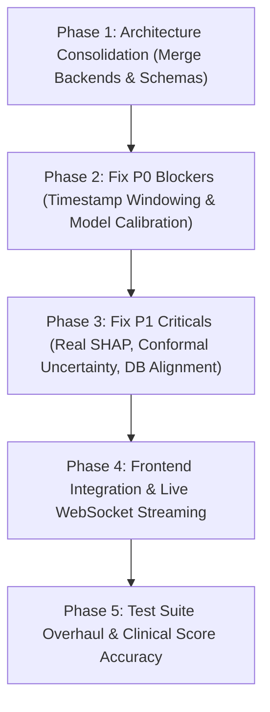

# ARGUS Part 2 Technical Audit

## 1. Executive Summary
This document presents the complete technical audit of the **ARGUS Part 2** project prior to stabilization work. The audit was conducted in a strict read-only mode, combining static code inspection, database schema comparison, model artifact evaluation, pipeline tracing, runtime analysis, and test suite execution.

The project contains a well-structured domain vision for real-time sepsis prediction and clinical alert management. However, the existing implementation suffers from **critical architectural bifurcations, data contract disconnects, fundamental timestamp/windowing bugs, uncalibrated ML model fallbacks, hardcoded UI mock data, and documentation-to-code mismatches**.

### Key Findings Snapshot
- **Total Issues Identified:** 16
- **P0 Blocker Issues:** 4 (System correctness and runtime integrity broken at fundamental level)
- **P1 Critical Issues:** 7 (Major architectural disconnects, fake SHAP/uncertainty, DB mismatch, training vs MIMIC documentation mismatch)
- **P2 Important Issues:** 3 (Clinical score formula inaccuracies, signal quality gaps, CORS/environment drift)
- **P3 Technical Debt:** 2 (FastAPI deprecation warnings, missing standardized error envelopes)
- **Application Code Modified:** **NONE (0 lines of code modified during audit)**

---

## 2. Current Architecture

The current project contains **two distinct, competing implementation pipelines** that operate independently without sharing data models, API endpoints, model artifact loaders, or database connections.

```mermaid
graph TD
    subgraph Pipeline A ["Pipeline A: src/backend (Mock Runtime)"]
        A_FE["src/frontend (React/Vite Dashboard - Hardcoded Mock Data)"]
        A_BE["src/backend/main.py (FastAPI Port 8000)"]
        A_SVC["src/backend/services (PatientService, InferenceService, AlertEngine)"]
        A_DB[("In-Memory Dict DB")]
        A_FE -.->|NO API CONNECTIONS| A_BE
        A_BE --> A_SVC --> A_DB
    end

    subgraph Pipeline B ["Pipeline B: deployment/backend (Live Inference Runtime)"]
        B_FE["deployment/frontend/src.jsx (Ultra-minimal log viewer)"]
        B_BE["deployment/backend/app/main.py (FastAPI Port 8000)"]
        B_RT["deployment/backend/app/service.py (Runtime XGBoost / Heuristic Fallback)"]
        B_DB[("SQLAlchemy SQLite / Postgres store.py")]
        B_FE -->|WebSocket /v1/stream| B_BE
        B_BE --> B_RT --> B_DB
    end
```



1. **Pipeline A (`src/backend` + `src/frontend`)**:
   - `src/frontend`: Modern dashboard UI components built with React and Vite. Operates on 100% hardcoded mock data constants with zero HTTP or WebSocket requests.
   - `src/backend`: FastAPI application on `/api/v1/patients`. Uses in-memory Python dictionaries (`patients_db`, `vitals_db`) and returns `random.uniform(0.1, 0.9)` for risk scores.
2. **Pipeline B (`deployment/backend` + `deployment/frontend`)**:
   - `deployment/backend`: FastAPI application on `/v1/events/vitals` and `/v1/stream`. Loads `xgb_model.json` (or falls back to a deterministic heuristic formula if calibrator unpickling fails). Calculates sliding-window features over in-memory `deque` history.
   - `deployment/frontend`: Minimal text-based event log UI that connects to `/v1/stream` via WebSockets.

---

## 3. Repository Structure

| Component | Path | Description / Notes | Multiple Implementations? |
|---|---|---|---|
| **Frontend** | `src/frontend/`<br>`deployment/frontend/` | `src/frontend`: Main React Dashboard (Hardcoded Mock Data).<br>`deployment/frontend`: Single-file debug console (`src.jsx`). | **YES (Dual)** |
| **Backend** | `src/backend/`<br>`deployment/backend/` | `src/backend`: REST API with FastAPI (`/api/v1`).<br>`deployment/backend`: Live stream & event backend (`/v1`). | **YES (Dual)** |
| **Database** | `deployment/database/schema.sql`<br>`deployment/backend/app/store.py` | `schema.sql`: 12 normalized PostgreSQL tables (`sepsisguard` schema).<br>`store.py`: 4 flat SQLAlchemy tables (`sepsisguard.db`). | **YES (Dual)** |
| **ML Models** | `model/` | Contains `xgb_model.json`, `lgb_model.txt`, `lr_model.pkl`, calibrators, and PyTorch temporal models (`gru_temporal.pt`, etc.). | **YES (Multiple Artifacts)** |
| **Training Pipeline** | `src/pipeline/`<br>`model/` | `05_train_models.py` through `11_smart_alert_engine.py`. Uses synthetic generator `generate_demo_dataset()`. | Single Pipeline |
| **Inference Service** | `src/inference/`<br>`deployment/backend/app/service.py` | `src/inference/main.py`: Dockerized standalone HTTP runner.<br>`deployment/backend/app/service.py`: Embedded runtime inside FastAPI backend. | **YES (Dual)** |
| **Simulator** | `src/simulator/simulator.py`<br>`deployment/backend/app/main.py` | `src/simulator/simulator.py`: Standalone CLI simulator.<br>`deployment/backend/app/main.py`: Async function `run_simulator()`. | **YES (Dual)** |
| **Tests** | `tests/` | Unit, integration, model, safety, system tests (`tests/unit`, `tests/integration`, etc.). | Single Suite |
| **Deployment** | `docker-compose.yml`<br>`deployment/docker-compose.yml` | `docker-compose.yml`: Root multi-service setup.<br>`deployment/docker-compose.yml`: Local deployment setup. | **YES (Dual)** |

---

## 4. Backend Audit

| Attribute | Backend 1 (`src/backend`) | Backend 2 (`deployment/backend`) |
|---|---|---|
| **Location** | [`src/backend/main.py`](file:///c:/Users/HP/Desktop/Argus/argus-sepsiswarner/src/backend/main.py) | [`deployment/backend/app/main.py`](file:///c:/Users/HP/Desktop/Argus/argus-sepsiswarner/deployment/backend/app/main.py) |
| **Framework** | FastAPI | FastAPI |
| **Entry Point** | `src.backend.main:app` | `deployment.backend.app.main:app` |
| **Startup Command** | `uvicorn src.backend.main:app --port 8000` | `uvicorn deployment.backend.app.main:app --port 8000` |
| **REST Routes** | `/api/v1/health`, `/api/v1/model-version`, `/api/v1/patients` | `/health`, `/v1/events/vitals`, `/v1/patients/{id}/latest`, `/v1/simulator/start` |
| **WebSocket Routes** | `/api/v1/ws` (Text Echo handler) | `/v1/stream` (Live Broadcast handler) |
| **Database Usage** | None (In-memory Python dictionaries) | SQLAlchemy ORM (`store.py`, SQLite/Postgres) |
| **ML Model Usage** | `random.uniform(0.1, 0.9)` (Mock) | `xgb_model.json` / Heuristic Logit Fallback |
| **Vitals Storage** | `vitals_db = {}` (Dict) | `VitalRecord` (SQLAlchemy Table) |
| **Status Classification** | **LEGACY / MOCK** | **CANDIDATE / RUNTIME** |

---

## 5. Data Contract Audit

The expected input schema is split across multiple definitions:

- **Deployment Pydantic Schema ([`deployment/backend/app/schemas.py`](file:///c:/Users/HP/Desktop/Argus/argus-sepsiswarner/deployment/backend/app/schemas.py)):**
  - `patient_id` (str, required)
  - `timestamp` (datetime, required)
  - `heart_rate` (float, optional, $0..400$)
  - `map` (float, optional, $0..300$)
  - `resp_rate` (float, optional, $0..100$)
  - `spo2` (float, optional, $0..100$)
  - `temperature_c` (float, optional, $20..50$)
  - `lactate` (float, optional, $0..30$)
  - `source` (Literal['simulator', 'integration'])

- **Backend Pydantic Schema ([`src/backend/schemas/schemas.py`](file:///c:/Users/HP/Desktop/Argus/argus-sepsiswarner/src/backend/schemas/schemas.py)):**
  - `Vital`: `heart_rate`, `blood_pressure` (string, e.g., "120/80"), `temperature`, `oxygen_saturation`, `timestamp` (string).

### Data Contract Mismatches
1. `src/backend` expects `blood_pressure` as a string (`"120/80"`), whereas `deployment/backend` expects Mean Arterial Pressure (`map`) as a float (`62.0`).
2. `src/backend` uses `oxygen_saturation`, while `deployment/backend` uses `spo2`.
3. `temperature` vs `temperature_c` unit naming discrepancy.
4. Neither backend handles `session_id`, `gcs`, `systolic_bp`, `diastolic_bp`, `sensor_status`, or `schema_version` expected for a complete Part 1 integration.

---

## 6. Timestamp and Windowing Audit

### Critical Finding (P0 Issue 1)
The runtime feature engineering layer in [`deployment/backend/app/service.py`](file:///c:/Users/HP/Desktop/Argus/argus-sepsiswarner/deployment/backend/app/service.py#L32-L40) uses **received event counts (deque indices)** as a direct substitute for clinical time:

```python
# deployment/backend/app/service.py:35-40
def mean(key): return float(np.nanmean(vals(key)[-4:]))
def std(key): return float(np.nanstd(vals(key)[-4:]))
d = lambda k,n: last(k)-last(k,n) if np.isfinite(last(k)) and np.isfinite(last(k,n)) else 0.

# Feature assembly:
'hr_mean_4h': mean('hr_curr'),    # Averages the last 4 deque items (last 4 EVENTS, not 4 hours)
'hr_delta_1h': d('hr_curr', 1),   # Subtracts item N minus item N-1 (last EVENT, not 1 hour ago)
'hr_delta_4h': d('hr_curr', 4),   # Subtracts item N minus item N-4 (4 EVENTS ago, not 4 hours ago)
```

In simulator streaming (where events arrive every 5 seconds):
- `hr_mean_4h` averages **20 seconds of vitals**, NOT 4 hours.
- `hr_delta_1h` computes the vital change over **5 seconds**, NOT 1 hour.
- `hr_delta_4h` computes the vital change over **20 seconds**, NOT 4 hours.

This produces severe numerical distortion when passing values into XGBoost, which was trained on 1-hour binned clinical data.

---

## 7. Feature Engineering Audit

### Training Features vs Runtime Features
- **Total Features:** 31 engineered features.
- **Feature Set:** `hr_curr`, `map_curr`, `rr_curr`, `spo2_curr`, `temp_curr`, `hr_mean_4h`, `hr_std_4h`, `hr_min_4h`, `hr_max_4h`, `map_mean_4h`, `map_std_4h`, `map_min_4h`, `rr_mean_4h`, `temp_mean_4h`, `hr_delta_1h`, `hr_delta_4h`, `hr_slope_4h`, `map_delta_1h`, `map_delta_4h`, `map_slope_4h`, `rr_delta_1h`, `temp_delta_1h`, `hr_accel`, `shock_index`, `resp_distress_idx`, `fever_response_idx`, `lactate_missing`, `time_since_lactate`, `qsofa_curr`, `map_time_low_4h`, `icu_hour`.

### Feature Discrepancies
1. **Documentation vs Code Feature Count:** [`docs/07_feature_engineering_framework.md`](file:///c:/Users/HP/Desktop/Argus/argus-sepsiswarner/docs/07_feature_engineering_framework.md) references 28 core features, but the actual runtime vector in [`deployment/backend/app/service.py`](file:///c:/Users/HP/Desktop/Argus/argus-sepsiswarner/deployment/backend/app/service.py#L14) defines 31 features.
2. **Missingness Imputation:** In offline training (`src/pipeline/05_train_models.py`), missing values are generated cleanly. In online runtime (`service.py`), missing values in rolling windows fall back to `0.0` or `np.nan`, which can cause undefined behavior in `xgb.DMatrix`.

---

## 8. Machine Learning Model Audit

### Primary Model Mismatch (P1 Issue 7)
- **Documented / Selection Decision:** [`model/model_selection_decision.json`](file:///c:/Users/HP/Desktop/Argus/argus-sepsiswarner/model/model_selection_decision.json#L2) explicitly declares `"primary_model": "Logistic Regression"`.
- **Runtime Loader:** [`deployment/backend/app/service.py`](file:///c:/Users/HP/Desktop/Argus/argus-sepsiswarner/deployment/backend/app/service.py#L20-L21) attempts to load [`model/xgb_model.json`](file:///c:/Users/HP/Desktop/Argus/argus-sepsiswarner/model/xgb_model.json) (XGBoost).

### Model Artifact Inspection
The `model/` directory contains:
- `lr_model.pkl`, `lr_calibrator.pkl` (Logistic Regression)
- `xgb_model.json`, `xgb_calibrator.pkl` (XGBoost)
- `lgb_model.txt`, `lgb_calibrator.pkl` (LightGBM)
- `gru_temporal.pt`, `lstm_temporal.pt`, `tcn_temporal.pt` (PyTorch Temporal Models)
- `scaler.pkl` (StandardScaler)

### Silent Calibration Failure & Fallback (P0 Issue 2)
In `deployment/backend/app/service.py`:
```python
# deployment/backend/app/service.py:22-30
try:
    import joblib
    self.cal = joblib.load(ROOT/'model'/'xgb_calibrator.pkl')
except Exception:
    # Silent failure: marks model as None and enables demo heuristic!
    self.model = None; self.demo = True
```
When `xgb_calibrator.pkl` fails to unpickle (due to custom class definition `SigmoidCalibrator` path mismatches), the runtime silently sets `self.model = None` and switches to the deterministic fallback formula:
$$\text{risk} = \sigma\left(\frac{HR-90}{20} + \frac{65-MAP}{15} + \frac{RR-20}{8} + \frac{Temp-38}{1.5}\right)$$
The system runs without an ML model while reporting status `"ok"`.

---

## 9. Dataset Audit

### Documentation vs Code Dataset Mismatch (P1 Issue 8)
- **Documentation:** [`docs/04_mimic_extraction_pipeline.md`](file:///c:/Users/HP/Desktop/Argus/argus-sepsiswarner/docs/04_mimic_extraction_pipeline.md) and [`docs/02_data_dictionary.md`](file:///c:/Users/HP/Desktop/Argus/argus-sepsiswarner/docs/02_data_dictionary.md) claim the model was trained on MIMIC-IV clinical data extracted from SQL tables.
- **Actual Training Code:** [`src/pipeline/05_train_models.py`](file:///c:/Users/HP/Desktop/Argus/argus-sepsiswarner/src/pipeline/05_train_models.py#L69-L88) executes `generate_demo_dataset(n_patients=300, max_hours=72)`.
- **Finding:** No Python script in `src/` or `model/` reads, processes, or trains on MIMIC-IV data. The training pipeline operates entirely on synthetic Gaussian-generated demo data.

---

## 10. Sepsis / SOFA / Label Audit

| Component | Status | Description / Notes |
|---|---|---|
| **Suspected Infection** | **PARTIAL** | Simulated via window offsets; no microbiology/antibiotic order matching code exists in pipeline. |
| **Sepsis-3 Labeling** | **PARTIAL** | Derived in synthetic generator via 6-hour prediction window before synthetic onset. |
| **qSOFA Score** | **PARTIAL / FLAWED** | Calculated as `int(rr_curr >= 22) + int(map_curr <= 65)`. Uses MAP instead of SBP ($\le 100$) and omits GCS. |
| **Full SOFA Score** | **MISSING** | 6-organ system SOFA (respiratory, coagulation, liver, cardiovascular, CNS, renal) is not implemented in online runtime. |
| **Acute SOFA Increase ($\ge 2$)** | **MISSING** | Delta SOFA over baseline is not calculated in online runtime. |
| **Prediction Horizon** | **IMPLEMENTED** | Fixed 6-hour prediction horizon defined in schemas and pipeline. |

---

## 11. Clinical Feature Naming Audit

1. **qSOFA Misconfiguration:**
   - Code calculates: `(rr_curr >= 22) + (map_curr <= 65)`
   - Clinical Standard: `(sbp <= 100) + (rr >= 22) + (gcs < 15)`
   - Flagged: Uses Mean Arterial Pressure (`map`) in place of Systolic Blood Pressure (`sbp`), and omits Glasgow Coma Scale (`gcs`).
2. **Respiratory Distress Index:**
   - Formula in code: `resp_distress_idx = rr_curr / max(spo2_curr, 1)`
   - Flagged: Custom heuristic proxy; not a standardized clinical score.
3. **Fever Response Index:**
   - Formula in code: `fever_response_idx = hr_curr - 10 * (temp_curr - 37)`
   - Flagged: Custom heuristic formula for pulse-temperature dissociation; non-standard naming.

---

## 12. Online Inference Audit

```
[VitalEvent Input]
       ↓
[Pydantic Schema Validation (deployment/backend/app/schemas.py)]
       ↓
[History Buffering (deque(maxlen=72))]  ←  CRITICAL BUG: Index assumed to equal 1 Hour
       ↓
[Feature Engineering (service.py)]
       ↓
[Model Loading Check]  ←  CRITICAL BUG: Silent failure falls back to heuristic formula
       ↓
[Probability Generation & Calibration]
       ↓
[Fixed ±0.20 Uncertainty Window]  ←  FLAWED: Hardcoded interval
       ↓
[Pseudo-SHAP Feature Sorting]  ←  FLAWED: Sorts 3 raw vitals by magnitude
       ↓
[Smart Alert Engine (11_smart_alert_engine.py)]
       ↓
[SQLite / Postgres Persistence (store.py)]
       ↓
[WebSocket Broadcast (/v1/stream)]
       ↓
[Frontend Display]  ←  CRITICAL BUG: src/frontend displays hardcoded mock data
```

---

## 13. SHAP / Explainability Audit

### Pseudo-SHAP Implementation (P1 Issue 6)
In [`deployment/backend/app/service.py`](file:///c:/Users/HP/Desktop/Argus/argus-sepsiswarner/deployment/backend/app/service.py#L56):
```python
factors = [
    f'{name.replace("_curr", "").upper()} contributed to the model prediction'
    for name in sorted(['map_curr', 'hr_curr', 'rr_curr'], key=lambda k: abs(row.get(k, 0)), reverse=True)
]
```
- Real TreeSHAP or Shapley value computation is **completely absent** from online inference.
- The runtime sorts 3 current vital numbers by absolute magnitude and formats template strings.

---

## 14. Uncertainty / Confidence Audit

### Hardcoded Interval Width (P1 Issue 5)
In [`deployment/backend/app/service.py`](file:///c:/Users/HP/Desktop/Argus/argus-sepsiswarner/deployment/backend/app/service.py#L55):
```python
interval = (max(0., p - .20), min(1., p + .20))
confidence = 'HIGH' if sq == 'HIGH' and .4 >= interval[1] - interval[0] else 'MEDIUM' if sq != 'LOW' else 'LOW'
```
- The uncertainty interval is hardcoded as $[p - 0.20, p + 0.20]$.
- Because $p + 0.20 - (p - 0.20) = 0.40$, the condition `.4 >= interval[1] - interval[0]` is **always true** (except at probability boundaries near 0 or 1).
- Conformal prediction and variance estimation are not implemented at runtime.

---

## 15. Alert Engine Audit

- **Implementation:** [`src/pipeline/11_smart_alert_engine.py`](file:///c:/Users/HP/Desktop/Argus/argus-sepsiswarner/src/pipeline/11_smart_alert_engine.py)
- **Severity Bands:** `YELLOW — WATCH` ($\ge 25\%$), `ORANGE — REVIEW` ($\ge 35\%$), `RED — URGENT` ($\ge 70\%$).
- **Hysteresis & Escalation:** Requires 2 consecutive elevated windows for escalation; 3 consecutive normal windows for de-escalation.
- **Repeat Cooldown:** 6 hours for Watch/Review; 2 hours for Urgent.
- **Defect:** In `deployment/backend/app/service.py`, `persistent_windows` is passed as `len(self.history[patient_id])` (event count), causing immediate alert escalation after 2 event ticks (10 seconds of simulation).

---

## 16. Database Audit

### Database Implementation Disconnect (P1 Issue 9)

```
1. deployment/database/schema.sql (PostgreSQL 16)
   └── 12 Schema Tables: users, patients, icu_stays, model_versions, observations,
       laboratory_results, model_predictions, explanations, alerts, alert_history,
       clinical_feedback, system_logs, audit_events.

2. deployment/backend/app/store.py (SQLAlchemy ORM)
   └── 4 Flat Tables: patients, vital_events, predictions, alerts.
       Defaults to SQLite sepsisguard.db.

3. src/backend/services/patient_service.py (In-Memory Python Dictionaries)
   └── patients_db = {}, vitals_db = {}.
```

The 12-table `schema.sql` database is **never written to or read from** by either backend application.

---

## 17. WebSocket Audit

| Route | Backend | Purpose | Status |
|---|---|---|---|
| `/api/v1/ws` | `src/backend` | Text echo handler (`Message text was: ...`) | **MOCK / UNUSED** |
| `/v1/stream` | `deployment/backend` | Live JSON broadcast channel for vitals, predictions, and alerts | **CANDIDATE** |

---

## 18. REST API Audit

### `src/backend` Routes (`/api/v1`)
- `GET /api/v1/health` — Returns `{"status": "healthy"}`
- `GET /api/v1/model-version` — Returns model version
- `POST /api/v1/patients` — Creates patient in dictionary `patients_db`
- `GET /api/v1/patients/{id}` — Gets patient from `patients_db`
- `GET /api/v1/patients/{id}/vitals` — Returns vitals from `vitals_db`
- `GET /api/v1/patients/{id}/risk` — Returns random float score
- `GET /api/v1/patients/{id}/explanation` — Returns hardcoded dictionary
- `GET /api/v1/patients/{id}/alerts` — Returns mock alert list

### `deployment/backend` Routes (`/v1`)
- `GET /health` — Returns service status and model version
- `POST /v1/events/vitals` — Ingests vital event, runs inference, broadcasts WS message, saves to ORM DB
- `GET /v1/patients/{patient_id}/latest` — Fetches latest prediction from ORM DB
- `POST /v1/simulator/start` — Triggers synthetic background generator task

---

## 19. Frontend Audit

### Hardcoded Mock Data (P0 Issue 3)
In [`src/frontend/src/App.tsx`](file:///c:/Users/HP/Desktop/Argus/argus-sepsiswarner/src/frontend/src/App.tsx):
- `MOCK_PATIENTS` (John Doe, Jane Smith, Robert Johnson, Maria Garcia)
- `TRAJECTORY_DATA` (hardcoded 24h risk trend points)
- `LAB_TRENDS_DATA` (hardcoded 4-day lab values)
- **Zero API Integration:** `App.tsx` contains 0 `fetch()`, `axios`, or `WebSocket` connections. Clicking patients or viewing metrics toggles internal React state between mock constants.

---

## 20. Testing Audit

### Test Suite Execution Results
- Command: `python -m pytest tests/`
- Result: 14 tests pass, **4 collection errors when run without `PYTHONPATH=.`**.

### Testing Weaknesses (P1 Issue 11)
1. **Import Errors:** `pytest tests/` fails out of the box with `ModuleNotFoundError: No module named 'src'` unless `python -m pytest` is explicitly used.
2. **Placeholder Tests (`assert True`):**
   - `test_feature_calculations()` in `tests/unit/test_unit.py:22` (`assert True`)
   - `test_missing_data_robustness()` in `tests/model/test_model.py:12` (`assert True`)
   - `test_outlier_handling()` in `tests/model/test_model.py:16` (`assert True`)
3. **Dummy Safety Tests:**
   - `test_alert_flooding_prevention()` in `tests/safety/test_safety.py:14-16` tests `len([True]*10) > 1` (does not invoke alert engine).
   - `test_abnormal_values_rejection()` in `tests/safety/test_safety.py:19-20` tests local variable `10.0 < 20` (does not test validation pipeline).
4. **Coverage Gap:** Zero tests exist for `deployment/backend/app/service.py`, feature windowing, model calibration, signal quality, or WebSocket broadcasts.

---

## 21. Deployment Audit

1. **Docker Compose Bifurcation:**
   - Root [`docker-compose.yml`](file:///c:/Users/HP/Desktop/Argus/argus-sepsiswarner/docker-compose.yml) builds `./src/backend` and `./src/frontend`.
   - [`deployment/docker-compose.yml`](file:///c:/Users/HP/Desktop/Argus/argus-sepsiswarner/deployment/docker-compose.yml) builds `deployment/backend` and `deployment/frontend`.
2. **Environment Variable Drift:**
   - Root compose uses DB `sepsis_db` / user `sepsis_user`.
   - Deployment compose uses DB `sepsisguard` / user `sepsisguard`.
3. **Health Check Differences:**
   - Root backend checks `/health` on port 8000, while app router mounts health under `/api/v1/health`.

---

## 22. Documentation vs Code Audit

| Claim in Documentation | Document Path | Actual Code Implementation | Status |
|---|---|---|---|
| **MIMIC-IV Dataset Training** | `docs/04_mimic_extraction_pipeline.md` | Uses synthetic demo generator (`generate_demo_dataset()`) | **DOCUMENTATION / CODE MISMATCH** |
| **Primary Model: Logistic Regression** | `model/model_selection_decision.json` | Runtime loads `xgb_model.json` (XGBoost) | **DOCUMENTATION / CODE MISMATCH** |
| **TreeSHAP Explainability** | `docs/16_explainability_engine.md` | Sorts 3 raw vitals by magnitude in `service.py` | **DOCUMENTATION / CODE MISMATCH** |
| **PostgreSQL 12-Table Schema** | `docs/19_postgresql_data_model.md` | ORM uses 4 flat tables in SQLite/Postgres (`store.py`) | **DOCUMENTATION / CODE MISMATCH** |
| **Signal Quality Layer** | `docs/14_signal_quality_layer.md` | Minimal heuristic range check | **PARTIAL** |
| **Conformal Uncertainty** | `docs/15_uncertainty_estimation.md` | Hardcoded $p \pm 0.20$ interval in `service.py` | **DOCUMENTATION / CODE MISMATCH** |

---

## 23. Part 1 Integration Requirements

To integrate with a future **ARGUS Part 1** continuous streaming engine, Part 2 will require:

1. **Required Input Payload Fields:**
   - `patient_id` (string, max 64 chars)
   - `session_id` (string, max 64 chars)
   - `timestamp` (ISO-8601 UTC timestamp string or epoch float)
   - `heart_rate` (float, bpm)
   - `systolic_bp` (float, mmHg)
   - `diastolic_bp` (float, mmHg)
   - `map` (float, mmHg; optional if SBP and DBP provided)
   - `resp_rate` (float, breaths/min)
   - `spo2` (float, percentage)
   - `temperature_c` (float, °C)

2. **Optional Clinical & Meta Fields:**
   - `lactate` (float, mmol/L)
   - `gcs` (integer, 3..15)
   - `source` ('simulator' | 'device' | 'ehr')
   - `signal_quality` ('HIGH' | 'MEDIUM' | 'LOW')

3. **Streaming & Ordering Requirements:**
   - Out-of-order event handling via explicit timestamp sorting in feature window buffer.
   - Deduping based on `(patient_id, timestamp)`.

---

## 24. P0 Issues (Blockers)

### P0 Issue 1: Event Count Substituted for Clinical Time in Feature Windowing
- **Current Behaviour:** Rolling window features (`hr_mean_4h`, `hr_delta_1h`, `map_time_low_4h`) use array index offsets (`vals(key)[-4:]`, `d('hr_curr', 1)`). They assume 1 deque item = 1 clinical hour. In real/simulated streaming (5-second cadence), `hr_mean_4h` averages 20 seconds of data.
- **Expected Behaviour:** Windowing must group events by actual timestamp deltas (`timestamp >= now - 4 hours`, `timestamp >= now - 1 hour`).
- **Evidence:** [`deployment/backend/app/service.py:32-40`](file:///c:/Users/HP/Desktop/Argus/argus-sepsiswarner/deployment/backend/app/service.py#L32-L40).
- **Severity:** P0 — BLOCKER
- **Affected Files:** `deployment/backend/app/service.py`, `src/pipeline/11_smart_alert_engine.py`.
- **Recommended Future Fix:** Implement true time-aware resampling/windowing using Pandas/NumPy time offsets.

### P0 Issue 2: Silent Model Load Failure & Dev Fallback Substitution
- **Current Behaviour:** Unpickling `xgb_calibrator.pkl` in `service.py` fails due to module import path differences, silently setting `self.model = None` and falling back to a deterministic heuristic formula `float(1/(1+np.exp(...)))`.
- **Expected Behaviour:** Model loading must fail loudly or resolve custom calibrator classes cleanly, ensuring production ML inference runs.
- **Evidence:** [`deployment/backend/app/service.py:22-30`](file:///c:/Users/HP/Desktop/Argus/argus-sepsiswarner/deployment/backend/app/service.py#L22-L30).
- **Severity:** P0 — BLOCKER
- **Affected Files:** `deployment/backend/app/service.py`, `model/xgb_calibrator.pkl`.
- **Recommended Future Fix:** Package calibrator classes into a shared library or export standard Platt calibration parameters without custom Python class dependencies.

### P0 Issue 3: Disconnected Frontend – Hardcoded Data Only
- **Current Behaviour:** `src/frontend/src/App.tsx` contains zero API calls, displaying static mock constants (`John Doe`, `87%` risk).
- **Expected Behaviour:** React frontend components must fetch data from backend REST endpoints and subscribe to WebSocket streams.
- **Evidence:** [`src/frontend/src/App.tsx:27-48`](file:///c:/Users/HP/Desktop/Argus/argus-sepsiswarner/src/frontend/src/App.tsx#L27-L48).
- **Severity:** P0 — BLOCKER
- **Affected Files:** `src/frontend/src/App.tsx`, `src/frontend/src/api/` (to be created).
- **Recommended Future Fix:** Connect React state to backend REST and WebSocket hooks.

### P0 Issue 4: Dual Disconnected Backend Architectures
- **Current Behaviour:** Two parallel backends (`src/backend` and `deployment/backend`) exist with conflicting routes, models, schemas, and stores.
- **Expected Behaviour:** Consolidate into a single unified backend service architecture.
- **Evidence:** `src/backend/main.py` vs `deployment/backend/app/main.py`.
- **Severity:** P0 — BLOCKER
- **Affected Files:** `src/backend/*`, `deployment/backend/*`, `docker-compose.yml`.
- **Recommended Future Fix:** Merge `deployment/backend/app` features into `src/backend` clean structure.

---

## 25. P1 Issues (Critical)

### P1 Issue 5: Hardcoded Fake Uncertainty / Confidence Intervals
- **Current Behaviour:** Uncertainty interval is hardcoded as $p \pm 0.20$ (`(max(0., p - .20), min(1., p + .20))`).
- **Expected Behaviour:** Compute calibrated conformal prediction intervals or model ensemble variance.
- **Evidence:** [`deployment/backend/app/service.py:55`](file:///c:/Users/HP/Desktop/Argus/argus-sepsiswarner/deployment/backend/app/service.py#L55).
- **Severity:** P1 — CRITICAL
- **Affected Files:** `deployment/backend/app/service.py`.

### P1 Issue 6: Fake SHAP / Feature Explanation Logic
- **Current Behaviour:** Feature contributions are generated by sorting 3 raw vitals by value.
- **Expected Behaviour:** Compute actual TreeSHAP values using `shap.TreeExplainer` on the model.
- **Evidence:** [`deployment/backend/app/service.py:56`](file:///c:/Users/HP/Desktop/Argus/argus-sepsiswarner/deployment/backend/app/service.py#L56).
- **Severity:** P1 — CRITICAL
- **Affected Files:** `deployment/backend/app/service.py`.

### P1 Issue 7: Primary Model Selection Mismatch
- **Current Behaviour:** `model_selection_decision.json` selects Logistic Regression, while runtime loads XGBoost.
- **Expected Behaviour:** Synchronize documented selection decision with the model loaded at runtime.
- **Evidence:** `model/model_selection_decision.json` vs `deployment/backend/app/service.py:21`.
- **Severity:** P1 — CRITICAL
- **Affected Files:** `model/model_selection_decision.json`, `deployment/backend/app/service.py`.

### P1 Issue 8: Documentation vs Code Mismatch (MIMIC-IV vs Synthetic Data)
- **Current Behaviour:** Docs claim MIMIC-IV dataset training, while `05_train_models.py` uses synthetic data generation.
- **Expected Behaviour:** Align documentation or provide actual MIMIC-IV training execution paths.
- **Evidence:** `docs/04_mimic_extraction_pipeline.md` vs `src/pipeline/05_train_models.py:69`.
- **Severity:** P1 — CRITICAL
- **Affected Files:** `docs/04_mimic_extraction_pipeline.md`, `src/pipeline/05_train_models.py`.

### P1 Issue 9: Database Schema Mismatch
- **Current Behaviour:** 12-table `schema.sql` vs 4-table SQLAlchemy `store.py` vs in-memory dicts.
- **Expected Behaviour:** Align SQLAlchemy models with `schema.sql` PostgreSQL tables.
- **Evidence:** `deployment/database/schema.sql` vs `deployment/backend/app/store.py`.
- **Severity:** P1 — CRITICAL
- **Affected Files:** `deployment/database/schema.sql`, `deployment/backend/app/store.py`.

### P1 Issue 10: WebSocket Endpoint Disconnect & Echo Dummy Handler
- **Current Behaviour:** `/api/v1/ws` in `src/backend` echoes back text strings; `/v1/stream` in `deployment/backend` broadcasts events, but frontend connects to neither.
- **Expected Behaviour:** Single unified WebSocket endpoint broadcasting real-time predictions and alerts to frontend.
- **Evidence:** `src/backend/api/endpoints/patients.py:56` vs `deployment/backend/app/main.py:48`.
- **Severity:** P1 — CRITICAL
- **Affected Files:** `src/backend/api/endpoints/patients.py`, `deployment/backend/app/main.py`.

### P1 Issue 11: Broken Test Collection & Dummy `assert True` Assertions
- **Current Behaviour:** `pytest tests/` fails with import error without `PYTHONPATH=.`; 4 tests contain `assert True` or test dummy local variables.
- **Expected Behaviour:** All tests must pass out of the box and assert real application logic.
- **Evidence:** `tests/unit/test_unit.py`, `tests/model/test_model.py`, `tests/safety/test_safety.py`.
- **Severity:** P1 — CRITICAL
- **Affected Files:** `tests/unit/*`, `tests/model/*`, `tests/safety/*`.

---

## 26. P2 Issues (Important)

### P2 Issue 12: Feature Naming & Clinical Score Formulas
- **Current Behaviour:** `qsofa_curr` uses MAP instead of SBP and omits GCS.
- **Expected Behaviour:** Standardize qSOFA calculation: $\text{SBP} \le 100$, $\text{RR} \ge 22$, $\text{GCS} < 15$.
- **Evidence:** `deployment/backend/app/service.py:40`.
- **Severity:** P2 — IMPORTANT
- **Affected Files:** `deployment/backend/app/service.py`.

### P2 Issue 13: Signal Quality Layer Heuristic Gaps
- **Current Behaviour:** Quality checking is limited to basic range boundaries.
- **Expected Behaviour:** Implement signal quality index (SQI) for lead disconnects and physiological artifacts.
- **Evidence:** `deployment/backend/app/service.py:47`.
- **Severity:** P2 — IMPORTANT
- **Affected Files:** `data/04_signal_quality.py`, `deployment/backend/app/service.py`.

### P2 Issue 14: Environment Configuration & Port Alignment Drift
- **Current Behaviour:** Inconsistent Postgres credentials and URLs across root and deployment `docker-compose.yml`.
- **Expected Behaviour:** Single, centralized `.env` configuration template.
- **Evidence:** `docker-compose.yml` vs `deployment/docker-compose.yml`.
- **Severity:** P2 — IMPORTANT
- **Affected Files:** `docker-compose.yml`, `deployment/docker-compose.yml`, `.env.example`.

---

## 27. P3 Issues (Improvements & Technical Debt)

### P3 Issue 15: Deprecated FastAPI Event Handlers & Pydantic V2 Migration Warnings
- **Current Behaviour:** `@app.on_event("startup")` and deprecated Pydantic `class Config` trigger warnings during execution.
- **Expected Behaviour:** Upgrade to FastAPI lifespan handlers and Pydantic `ConfigDict`.
- **Evidence:** Pytest warning logs.
- **Severity:** P3 — IMPROVEMENT
- **Affected Files:** `src/backend/main.py`, `src/backend/core/config.py`, `src/backend/schemas/schemas.py`.

### P3 Issue 16: Missing Standardized REST Error Envelopes
- **Current Behaviour:** Error responses vary between string messages and HTTP 422 default payloads.
- **Expected Behaviour:** Return consistent JSON error envelopes `{ "error": { "code": ..., "message": ... } }`.
- **Evidence:** `src/backend/core/exceptions.py`.
- **Severity:** P3 — IMPROVEMENT
- **Affected Files:** `src/backend/core/exceptions.py`.

---

## 28. Recommended Fix Order



1. **Step 1:** Consolidate `deployment/backend/app` logic into `src/backend` (P0 Issue 4).
2. **Step 2:** Fix timestamp/windowing logic to use actual clinical timestamps instead of event counts (P0 Issue 1).
3. **Step 3:** Fix model unpickling/calibration loading and resolve Logistic Regression vs XGBoost selection (P0 Issue 2, P1 Issue 7).
4. **Step 4:** Replace hardcoded uncertainty and pseudo-SHAP with real TreeSHAP and conformal bounds (P1 Issue 5, P1 Issue 6).
5. **Step 5:** Connect `src/frontend` to real REST and WebSocket endpoints (P0 Issue 3).
6. **Step 6:** Align database schemas between SQLAlchemy ORM and `schema.sql` (P1 Issue 9).
7. **Step 7:** Overhaul test suite, remove `assert True` placeholders, and add `pytest.ini` for `PYTHONPATH` (P1 Issue 11).

---

## 29. Risks

1. **Clinical Risk of Incorrect Alert Timings:** Using event counts for time windowing means that rapid event arrival triggers false alarms within seconds, creating severe nurse alert fatigue.
2. **Silent Failure Risk:** Falling back to a deterministic heuristic formula without throwing an error masks ML model failures in production.
3. **Data Loss Risk:** Using in-memory dicts or mismatched ORM tables prevents long-term storage of patient vitals and prediction audit histories.

---

## 30. Final Part 2 Readiness Status

- **Status:** **NOT READY FOR PRODUCTION / STABILIZATION REQUIRED**
- **Reasoning:** 4 P0 blockers and 7 P1 critical issues prevent reliable ML inference, accurate feature windowing, and frontend data visualization.
- **Next Phase:** Proceed to Phase 2 (Stabilization Planning & Fix Execution) following the recommended fix order.
