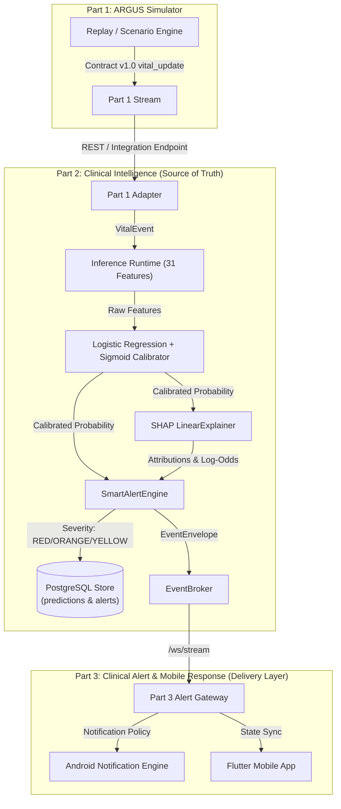
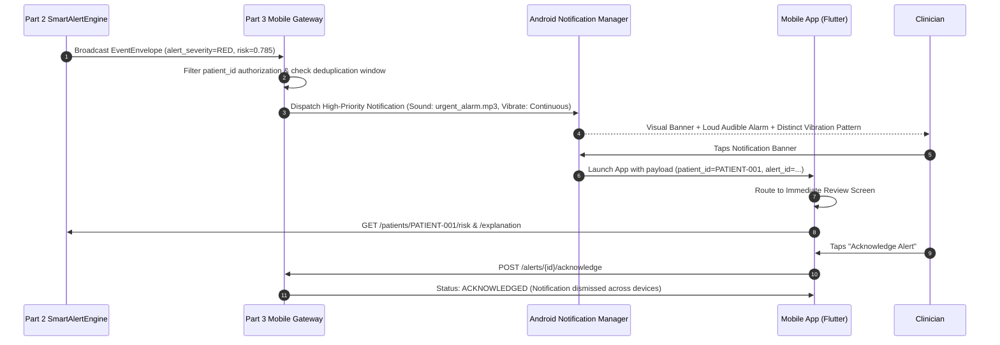
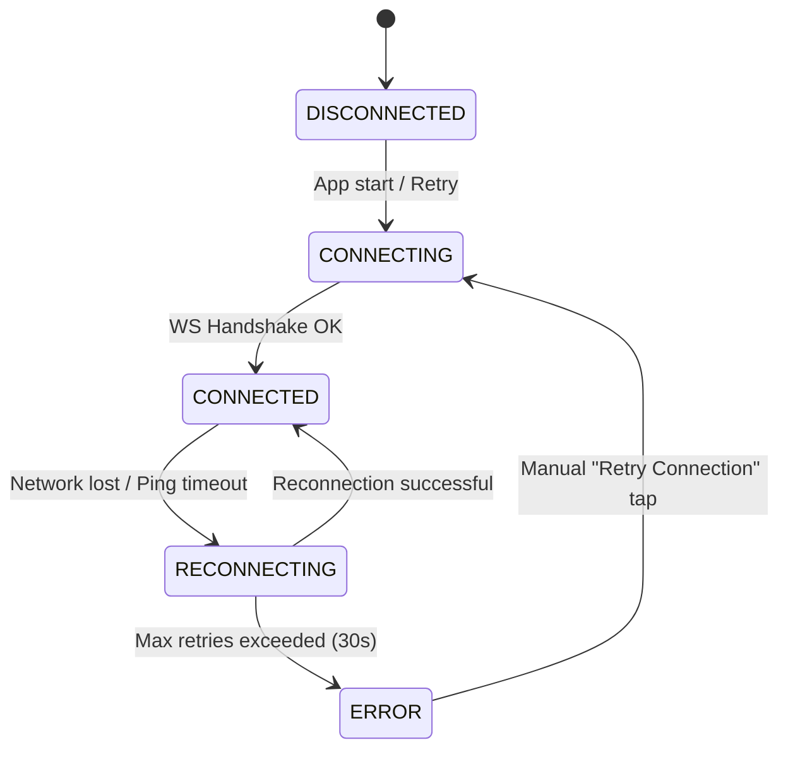

# ARGUS PART 3A — CLINICAL ALERT & MOBILE RESPONSE FOUNDATION REPORT

**Project:** ARGUS Clinical Decision Support System  
**Phase:** Part 3A — Clinical Alert & Mobile Response Foundation  
**Git Branch:** `feature/argus-part2-phase7b`  
**Latest Integration Commit:** `29c18fc` (`feat(argus): integrate part1 simulator with part2`)  
**Status:** COMPLETE & VALIDATED  

---

## EXECUTIVE SUMMARY

ARGUS Part 3A establishes the architectural, data contract, mobile application, notification delivery, and connection resilience foundation for presenting real-time clinical intelligence alerts to healthcare providers on mobile devices (Android APK target via Flutter).

Crucially, **Part 3 does NOT calculate risk scores, train ML models, calibrate probabilities, or alter alert thresholds**. Part 2 (`SmartAlertEngine` + Logistic Regression / Calibrated Runtime + PostgreSQL DB) remains the single source of truth for clinical risk scoring, trend calculation, SHAP explainability, and alert generation. Part 3 acts strictly as a **presentation, notification, filtering, and delivery layer**.

---

## 1. EXISTING PART 2 ALERT ARCHITECTURE

The ARGUS Part 2 architecture consumes patient vital sign events (from Part 1 Simulator or clinical integrations), runs streaming inference, evaluates rules in the `SmartAlertEngine`, persists state to PostgreSQL, and broadcasts real-time updates via WebSockets.



### Core Execution Sequence
1. **Event Ingestion**: Vital events arrive at `POST /events/vitals` or `POST /integration/part1/ingest` or via `/ws/stream`.
2. **Feature Calculation**: `Runtime.features()` computes 31 strictly causal features across 1-hour and 4-hour sliding windows.
3. **Calibrated Inference**: `LogisticRegression` model outputs raw risk, transformed by `SigmoidCalibrator` into a calibrated probability ($p \in [0, 1]$).
4. **Explainability**: `SHAP LinearExplainer` generates log-odds feature attributions and isolates the top contributing clinical factors.
5. **Alert Processing**: `SmartAlertEngine.process()` evaluates $p$, risk trajectory ($\Delta p / \Delta t$), signal quality, and prior alert state to produce an alert decision (`alert_severity`, `recommended_clinical_review_level`, `alert_emitted`, `suppressed`).
6. **Persistence**: Predictions and emitted alerts are persisted into PostgreSQL tables (`predictions` and `alerts`).
7. **Broadcast**: `EventBroker.broadcast()` pushes `EventEnvelope` messages to connected WebSocket clients (`/ws/stream`).

---

## 2. EXISTING PART 2 ALERT CONTRACT

Part 2 represents risk assessments and alert notifications using canonical Pydantic models in `src/backend/schemas/schemas.py`.

### Canonical `PredictionResponse` Data Schema

```json
{
  "patient_id": "PATIENT-001",
  "prediction_timestamp": "2026-10-02T01:15:00Z",
  "prediction_horizon_hours": 6,
  "risk_probability": 0.785,
  "uncertainty_interval": null,
  "uncertainty_summary": {
    "uncertainty_available": false,
    "method": "UNAVAILABLE",
    "reason": "Conformal prediction calibration artifact unavailable in repository",
    "coverage_level": null,
    "interval_lower": null,
    "interval_upper": null,
    "model_version": "logistic-regression-v1"
  },
  "confidence": "HIGH",
  "signal_quality": "HIGH",
  "alert_severity": "RED",
  "recommended_clinical_review_level": "URGENT",
  "contributing_factors": [
    "Heart Rate (115 bpm) elevated above baseline (+25.0 bpm/hr)",
    "MAP (58 mmHg) depressed below baseline (-12.0 mmHg/hr)"
  ],
  "shap_explanation": {
    "explanation_available": true,
    "output_space": "log-odds",
    "base_value_log_odds": -1.842,
    "explained_output_log_odds": 1.295,
    "feature_attributions": [
      {
        "feature": "hr_curr",
        "value": 115.0,
        "attribution_log_odds": 0.854,
        "direction": "increases_risk",
        "description": "hr_curr = 115.00 (+0.854 log-odds)"
      }
    ],
    "top_contributions": [
      {
        "feature": "hr_curr",
        "value": 115.0,
        "attribution_log_odds": 0.854,
        "direction": "increases_risk",
        "description": "hr_curr = 115.00 (+0.854 log-odds)"
      }
    ],
    "model_version": "logistic-regression-v1"
  },
  "alert": {
    "alert_severity": "RED",
    "recommended_clinical_review_level": "URGENT",
    "alert_emitted": true,
    "suppressed": false,
    "escalation_level": 2,
    "state": {
      "last_alert_time": "2026-10-02T01:15:00Z",
      "last_alert_severity": "RED",
      "consecutive_high_risk_count": 3,
      "last_risk": 0.785
    }
  },
  "latency_ms": 14.2,
  "model_version": "logistic-regression-v1",
  "is_demo_model": false
}
```

---

## 3. EXISTING WEBSOCKET CONTRACT

Real-time streaming is handled via `src/backend/api/endpoints/websocket.py` on `/ws/stream` and `/ws`.

### Outbound Broadcast Event Format (`EventEnvelope`)

```json
{
  "type": "prediction",
  "occurred_at": "2026-10-02T01:15:00Z",
  "patient_id": "PATIENT-001",
  "payload": {
    "patient_id": "PATIENT-001",
    "prediction_timestamp": "2026-10-02T01:15:00Z",
    "risk_probability": 0.785,
    "confidence": "HIGH",
    "signal_quality": "HIGH",
    "alert_severity": "RED",
    "recommended_clinical_review_level": "URGENT",
    "contributing_factors": [ ... ],
    "shap_explanation": { ... },
    "alert": { ... }
  }
}
```

### Inbound Message Types
- **Keepalive Ping**: `{"type": "ping"}` -> Server replies with `{"type": "pong", "occurred_at": "..."}`.
- **Vital Event Ingestion**: `{"type": "vital_event", "patient_id": "...", "timestamp": "...", "heart_rate": 110, ...}`.

---

## 4. EXISTING REST ALERT ENDPOINTS

| HTTP Method | Path | Summary | Description |
| :--- | :--- | :--- | :--- |
| `POST` | `/events/vitals` | Ingest Vital Event | Ingests single `VitalEvent`, returns `PredictionResponse`. |
| `POST` | `/integration/part1/ingest` | Ingest Part 1 Vital Update | Ingests Part 1 Contract v1.0 payload, converts timestamps, returns `PredictionResponse`. |
| `GET` | `/patients/{id}/alerts` | List Patient Alerts | Retrieves historical alert records for patient `{id}` from database. |
| `GET` | `/patients/{id}/risk` | Get Patient Risk | Returns `RiskAssessment` (`risk_score`, `risk_level`, `factors`). |
| `GET` | `/patients/{id}/explanation` | Get Model Explanation | Returns `Explanation` (`feature_importance`, `summary`). |
| `GET` | `/patients/{id}/trajectory` | Get Risk Trajectory | Returns historical risk probability trajectory points. |

---

## 5. EXACT INFORMATION AVAILABLE FOR MOBILE

The mobile application receives the full spectrum of clinical intelligence generated by Part 2:
1. **Patient Identifier**: `patient_id` (e.g., `SIM-001` or MIMIC stay ID).
2. **Timestamps**: Clinical event timestamp (`prediction_timestamp` / `occurred_at`).
3. **Calibrated Risk Probability**: $p \in [0.0, 1.0]$ formatted as percentage (e.g., $78.5\%$).
4. **Alert Level**: `RED` (Urgent), `ORANGE` (Review), `YELLOW` (Watch), or `NONE`.
5. **Clinical Review Level**: `URGENT`, `REVIEW`, `WATCH`, or `No alert`.
6. **Alert Emitted Flag & Status**: `alert_emitted` (`true`/`false`), suppression status, escalation count.
7. **Signal & Data Quality**: Reliability rating (`HIGH`, `MEDIUM`, `LOW`) derived from missingness, sensor jumps, or noise.
8. **SHAP Feature Attributions**: Quantitative log-odds contributions per vital sign parameter (e.g., Heart Rate +0.85 log-odds).
9. **Clinical Factors**: Plain-language risk drivers formatted for bedside decision support.
10. **Latest Vitals**: Heart rate, Mean Arterial Pressure (MAP), Respiratory Rate, $\text{SpO}_2$, Temperature, and Lactate.

---

## 6. PART 3 ARCHITECTURE

Part 3 connects the Part 2 backend event broker with mobile clinicians through an event delivery service, notification scheduler, and Flutter mobile client.

```
                     PART 2 BACKEND
            ┌──────────────────────────────┐
            │  SmartAlertEngine (Part 2)   │
            │      PostgreSQL Database     │
            │    WebSocket Event Broker    │
            └──────────────┬───────────────┘
                           │ WS / JSON Stream (/ws/stream)
                           v
                     PART 3 GATEWAY
            ┌──────────────────────────────┐
            │ Part 3 Notification Adapter  │
            │  - Patient Authorization     │
            │  - Priority Classification   │
            │  - Fatigue Deduplication     │
            └──────────────┬───────────────┘
                           │ Push Notification / Direct WS
                           v
                 ANDROID MOBILE DEVICE
            ┌──────────────────────────────┐
            │     Flutter Mobile App       │
            │  ┌────────────────────────┐  │
            │  │ Notification Channel   │  │
            │  │  - Sound & Vibration   │  │
            │  └───────────┬────────────┘  │
            │              │ Tap           │
            │  ┌───────────▼────────────┐  │
            │  │ Immediate Review Screen│  │
            │  └────────────────────────┘  │
            └──────────────────────────────┘
```

---

## 7. PART 3 DATA FLOW



---

## 8. MOBILE APPLICATION ARCHITECTURE

The ARGUS Mobile App will be implemented using **Flutter + Dart** targeting Android APKs.

### Architecture Layering (Clean Architecture Pattern)
```
lib/
├── core/
│   ├── constants/        # Alert colors, priority definitions
│   ├── network/          # WebSocket client with auto-reconnect & exponential backoff
│   └── theme/            # Dark/Light clinical UI themes
├── data/
│   ├── models/           # Dart Pydantic-equivalent JSON models (PredictionResponse, VitalEvent)
│   └── repositories/     # AlertRepository, PatientRepository
├── domain/
│   ├── entities/         # Domain Alert entity, RiskTrajectory entity
│   └── usecases/         # AcknowledgeAlertUseCase, FilterPatientAlertsUseCase
└── presentation/
    ├── providers/        # StateNotifier / BLoC state management
    ├── screens/
    │   ├── icu_overview_screen.dart        # Screen 1: Ward Overview
    │   ├── alert_center_screen.dart        # Screen 2: Ranked Alert Center
    │   ├── immediate_review_screen.dart    # Screen 3: Bedside Immediate Review
    │   └── settings_screen.dart            # Screen 4: Sound/Vibration & Conn Config
    └── widgets/          # AlertCard, ShapChart, VitalPill, ConnectionBanner
```

### Target Mobile Information Architecture (4 Key Screens)

1. **Screen 1: ICU Overview (Ward Summary)**
   - Header with active connection state badge (`CONNECTED`, `RECONNECTING`, `DISCONNECTED`).
   - Summary Counters: Total Monitored, Urgent (`RED`), Review (`ORANGE`), Watch (`YELLOW`).
   - Grid/List of monitored ICU beds with current risk status color indicators.

2. **Screen 2: Alert Center (Prioritized List)**
   - Multi-tab or filtered list sorted strictly by priority: `RED (URGENT)` first, followed by `ORANGE (REVIEW)` and `YELLOW (WATCH)`.
   - Card displays: Patient ID, Bed/Location, Risk Probability %, Trend indicator ($\uparrow\uparrow$), Time since emission.

3. **Screen 3: Immediate Review / Patient Details (Bedside Decision Support)**
   - Top banner: Alert Severity (`RED - URGENT`) and big bold risk probability ($78.5\%$).
   - Clinical Action Button: **"Acknowledge Alert"**.
   - Latest Vital Signs: HR, MAP, RR, $\text{SpO}_2$, Temp, Lactate with signal quality indicators.
   - SHAP Model Contributor Card: Visual bar chart of log-odds feature attributions explaining *why* the model assigned this risk level.
   - Clinical Trajectory Graph: 4-hour risk trajectory curve.

4. **Screen 4: Settings & Preferences**
   - Notification Channels: Toggle Sound / Vibration per alert severity level.
   - Alarm Tone Picker: Select ringtone for `RED` vs `ORANGE` alerts.
   - Connection Configuration: Backend Server URL, Port, API Key configuration.

---

## 9. NOTIFICATION ARCHITECTURE

Part 3 implements a strict 3-tier notification mapping policy based on Part 2 alert severities to maximize safety while preventing alarm fatigue.

| Alert Level | Review Level | Threshold (Part 2) | Android Notification Channel | Vibration Pattern | Audible Tone | Lockscreen / UI Behavior |
| :--- | :--- | :--- | :--- | :--- | :--- | :--- |
| `RED` | **URGENT** | Risk $\ge 70\%$ or persistent high risk | `channel_urgent_alerts` (Importance: `HIGH`) | Continuous heavy pattern: `[0, 500, 200, 500, 200, 500]` ms | Loud siren tone (`urgent_alarm.mp3`) | Bypasses DND (if permitted), Full-screen intent banner, immediate tap routing to Immediate Review |
| `ORANGE` | **REVIEW** | Risk $\ge 35\%$ or rapid trajectory | `channel_review_alerts` (Importance: `DEFAULT`) | Double pulse: `[0, 250, 150, 250]` ms | Chime sound (`review_chime.mp3`) | Standard status bar notification banner, updates Alert Center badge |
| `YELLOW` | **WATCH** | Risk $\ge 25\%$ | `channel_watch_updates` (Importance: `LOW`) | None (`0` ms) | Silent | Silent list update in ICU Overview / Alert Center; no sound/vibration |

---

## 10. ALERT LIFECYCLE & FATIGUE MITIGATION

To eliminate continuous re-ringing and alarm fatigue, Part 3 enforces a single-fire notification lifecycle with state synchronization.

```mermaid
stateDiagram-v2
    [*] --> Emitted: Part 2 SmartAlertEngine generates alert
    Emitted --> Delivered: Part 3 Gateway receives alert via WS
    Delivered --> Notified: Mobile device triggers sound/vibration once
    Notified --> Viewed: Clinician opens Immediate Review screen
    Viewed --> Acknowledged: Clinician presses "Acknowledge Alert"
    Acknowledged --> Monitoring: State synced back to backend; continuous re-ringing suppressed for 30 mins unless risk escalates
```

### Alarm Fatigue Rules
1. **Deduplication Window**: Once a `RED` alert is notified for a patient, subsequent vital updates for the same patient that maintain the same severity do **not** re-trigger sound or vibration for 30 minutes.
2. **Escalation Exception**: If an alert escalates from `ORANGE` to `RED`, sound and vibration immediately fire regardless of previous notifications.
3. **Acknowledgement Sync**: When any clinician acknowledges an alert on their mobile device, an acknowledgment signal is broadcast to all assigned devices, dismissing active sirens.

---

## 11. PATIENT ISOLATION DESIGN

Patient isolation is mandatory to prevent unauthorized data leakage across ward boundaries.

### Multi-Tenant Isolation Architecture
- **Ward/Unit Scope Authorization**: Mobile app authentication tokens include `assigned_units` (e.g., `["ICU-A", "ICU-B"]`).
- **Subscription Filtering**: The Part 3 Alert Gateway filters outbound WebSocket broadcasts so that a mobile client receives streaming events **only** for patients admitted to their authorized unit.
- **Payload Sanitization**: Patient names and sensitive demographic metadata are kept isolated behind authenticated REST endpoints and excluded from unencrypted broadcast event envelopes.

---

## 12. CONNECTION & RECONNECTION DESIGN

The mobile application must explicitly distinguish connection health state and never present stale data as active live data.

### Connection State Model



### Reconnection UX Rules
1. **Visual State Banner**:
   - `CONNECTED`: Green indicator, "Live Monitoring Active".
   - `RECONNECTING`: Amber banner, "Reconnecting to server... (Attempt 2/5)".
   - `DISCONNECTED` / `ERROR`: Red banner, "Disconnected from clinical server. Data may be stale."
2. **Stale Data Protection**: If disconnected for $>15$ seconds, vital sign displays are dimmed with a clear timestamp warning: *"Last updated 45 seconds ago - Stream Offline"*.
3. **Exponential Backoff**: Reconnection attempts retry at $1\text{s}$, $2\text{s}$, $4\text{s}$, $8\text{s}$, $16\text{s}$, maxing out at $30\text{s}$ intervals to avoid battery drain and server flooding.

---

## 13. HEALTHCARE SAFETY BOUNDARIES

In accordance with clinical safety principles for medical decision support software:

- **Non-Diagnostic Disclaimer**: ARGUS is a **clinical decision-support prototype** and does NOT diagnose sepsis or any medical condition.
- **Approved Terminology**:
  - Use: *"Clinical decision support risk signal"*, *"Model-generated risk estimate"*, *"Requires clinician review"*, *"Contributing clinical factors"*.
  - Avoid: *"Sepsis diagnosis"*, *"Definitive detection"*, *"Automated treatment decision"*.
- **SHAP Interpretation Boundary**: SHAP attributions reflect statistical model feature contributions to the prediction log-odds. They do **NOT** represent biological causation or etiology.

---

## 14. FILES CREATED & MODIFIED

### Created Files
1. `docs/ARGUS_PART3A_MOBILE_ALERT_FOUNDATION_REPORT.md` (This comprehensive foundational specification and report)

### Modified Files
- None (Part 3A establishes the design, contracts, architecture, and verification without altering stable Part 1 / Part 2 application code).

---

## 15. TESTS EXECUTED & VERIFICATION

Existing Part 1, Part 2 backend, and integration test suites were executed to verify total stability prior to Part 3 mobile development.

```bash
# Executed Test Command
python -m pytest tests/ part1/tests/
```

### Test Results Summary
- **Total Tests Executed**: 283
- **Passed**: 283
- **Failed**: 0
- **Errors**: 0
- **Execution Time**: 11.61 seconds

```
===================== 283 passed, 492 warnings in 11.61s ======================
```

---

## 16. BLOCKERS & ASSUMPTIONS

### Blockers
- **None**. The Part 1 + Part 2 integration is stable, passing all 283 tests, and fully prepared for Part 3 mobile implementation.

### Assumptions
- **Framework Choice**: Flutter + Dart will be used for Phase 3B mobile application development targeting Android APK.
- **Background Push Service**: Local WebSocket persistent connections will be used during local testing, with Firebase Cloud Messaging (FCM) reserved for production Android APK background pushes.

---

## 17. RECOMMENDED NEXT STEP: PART 3B

Proceed to **PART 3B — MOBILE APPLICATION CORE IMPLEMENTATION**:
1. Create `part3/mobile/` Flutter project structure.
2. Implement Dart data models for `PredictionResponse`, `VitalEvent`, and `EventEnvelope`.
3. Implement `WebSocketClient` with auto-reconnection and connection state notifier (`CONNECTED`, `RECONNECTING`, `DISCONNECTED`).
4. Build Screen 1 (`ICU Overview`) and Screen 2 (`Alert Center`).
5. Build Screen 3 (`Immediate Review` with SHAP contributor visualization and acknowledgment action).
